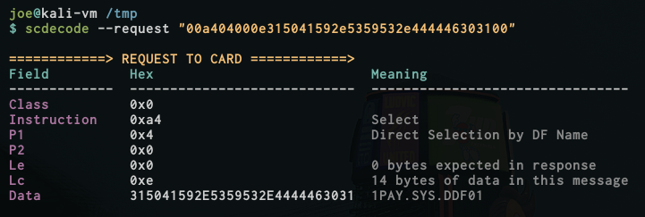
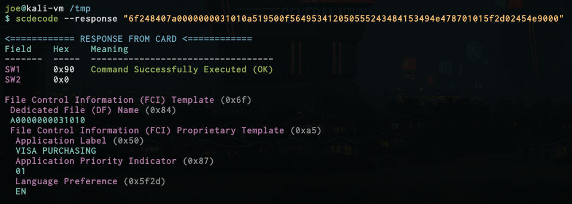
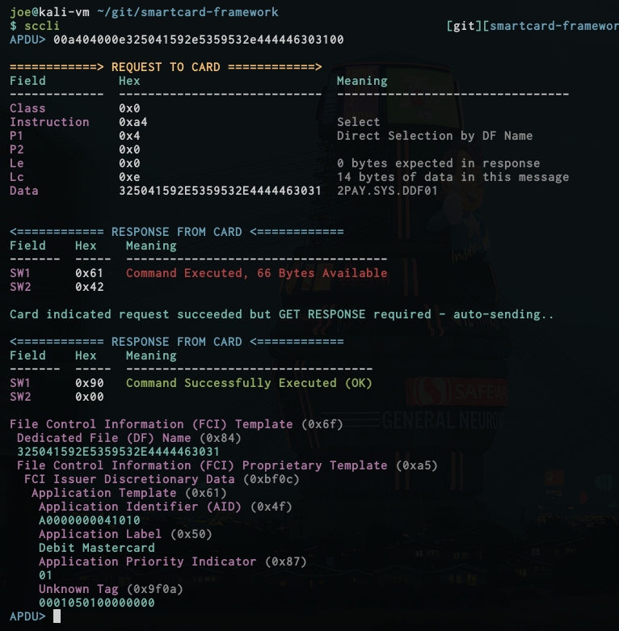

# smartcard-framework

## Overview

This project includes a set of Python 3 libraries for parsing ISO/IEC 7816 smartcard communications, and a set of tools that can be used to analyse smartcard communications without use of the Python libraries.

## Installation

Installation should be fairly simple - install the requirements from `requirements.txt`, then use the provided `setup.py` to install the library and its tools to your system. Adapt the following if you want to use Python virtual environments.

``` 
$ sudo pip3 install -r requirements.txt
$ sudo python3 setup.py install
```

## Basic Library Usage

### Parsing Request and Response APDUs

The following example makes use of the Request and Response classes to parse existing APDUs from a hex format.

```
from scframework.apdu import Request, Response

request  = Request.from_str("00a404000e325041592e5359532e444446303100")
response = Response.from_str("6f23840e325041592e5359532e4444463031a511bf0c0e610c4f07a00000000410108701019000")

print(request)
print(response)
```

Running the script should produce the following output:

```
Request(name=Select, cla=00, ins=a4, p1=04, p2=00, lc=0e, le=00)
Response(status='Command Successfully Executed (OK)', sw1=0x90, sw2=0x0)
```

Parsing a response APDU will always return a `Response` object, however things are slightly different when parsing a request APDU.

If the library recognises the parsed request APDU as a specific command, it will return a subclass of `Request`, such as `ReadRecord`. These subclasses inherit all of their functionality from their `Request` parent, however will return command-specific results for certain functions. For example, each `Request` object will feature several methods which can be used to explain the meaning of included arguments or data.

The following example parses a "READ RECORD" command, and prints information regarding the command's name, and the meaning of the P1 and P2 arguments in its context.

```
request = Request.from_str("00b2022400")
print("Name: " + request.get_name())
print("P1: " + request.explain_p1())
print("P2: " + request.explain_p2())
```

The output is as follows:

```
Name: Read Record
P1: Record Number 2 (0x2)
P2: Read Next Occurence
```

## Command Line Usage

### scdecode ###

The `scdecode` tool can be used to parse request and response APDUs.

For requests, the tool will display the type of command being performed, and the meaning of any arguments included. For responses, the tool will print the status code (e.g. OK, File Not Found), and attempt to parse the Tag-Length-Value (TLV) data included. The tool has knowledge of common smartcard and EMV tags and should be able to provide a human-friendly print out of the TLV data.

**Parsing a sample request**



**Parsing a sample response**



### sccli

The `sccli` tool provides a command-line interface through which you can send and receive APDUs. Requests and responses are auto-parsed by the library if possible in order to provide additional information. This is particularly useful when auto-parsing Tag-Length-Value (TLV) data included in APDU responses. The below screenshot shows an example in which the Proximity Payment System Environment has been selected by the user. The card confirms this requests succeeded, but a "GET RESPONSE" command must now be sent to retrieve the response. The tool can be seen automatically sending this "GET RESPONSE" command to retrieve and parse the stored data.




